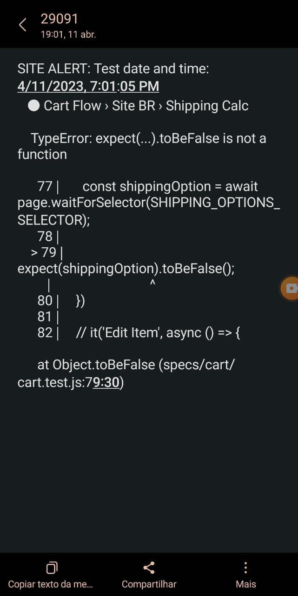

<div align="center">
  
  <p>A dependency that sends the test results in jest to sms via Algar sms to your phone!</p>
</div>

## Install

```sh
npm install --save-dev jest-algar-sms-reporter
# or
yarn add -D jest-algar-sms-reporter
```

## Usage

You must configure the jest config. Do not forget `phones` from yours phone numbers.

```javascript
module.exports = {
    ...

    reporters: [
    'default',
      ['jest-algar-sms-reporter', {
      from: 'Jest reporter',  // optional, default is 'Jest Reporter'
      phones: [
        '+5585999999999', //required, you can set how many phones you desire
       ] ,
      algarPath:'your-path-here', //required
      algarAuth:'your-auth-here',//required
      timeZone: 'America/Fortaleza', //optional, default is 'America/New_York'
      reportIfSuccess: false, // optional, default is false;
     }]
    ]
    ...
}
```

## Result

